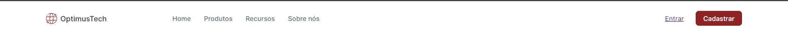
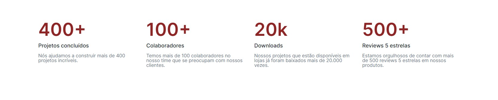
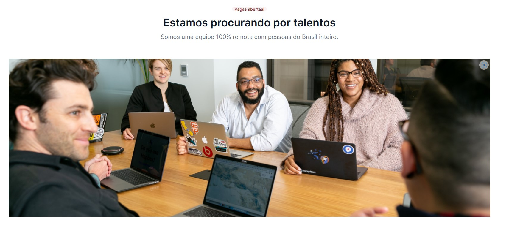

<h1 style="text-align:center;">#7DaysOfCode - HTML e CSS  💻</h1>

<h2 style="text-align:center;" > 💻 Dia 1 </h2>

 "Neste primeiro dia, você vai desenvolver o cabeçalho da aplicação, chamado normalmente de Navbar, que contempla o logo, o menu com as páginas e também os dois botões do canto direito."

 

<h2 style="text-align:center;" > 💻 Dia 2 </h2>

"O desafio de hoje é desenvolver a primeira seção da sua página, que também pode ser chamada de cabeçalho."

 

<h2 style="text-align:center;" > 💻 Dia 3 </h2>

"Continuando, hoje você vai desenvolver uma parte bem legal e desafiadora: a seção de métricas e resultados da sua página. Ela é uma seção muito comum na maioria das landing pages que vemos por aí hoje em dia."

 

<h2 style="text-align:center;" > 💻 Dia 4 </h2>

"O que você vai fazer hoje é a seção de "Estamos procurando por talentos", mas sem a parte de divulgação de vagas ainda, apenas até a imagem!"

 

